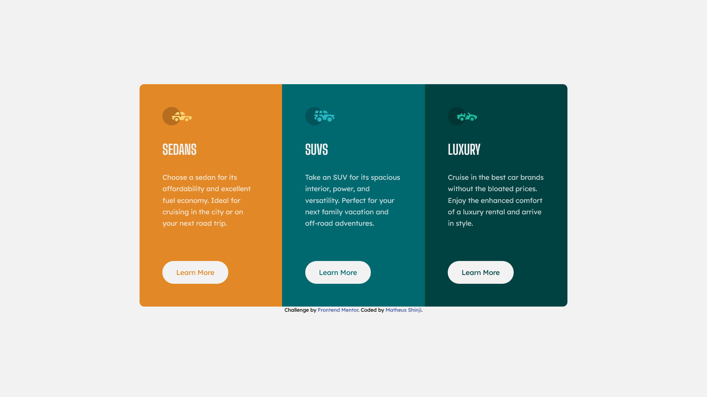

# Frontend Mentor - 3-column preview card component solution

This is a solution to the [3-column preview card component challenge on Frontend Mentor](https://www.frontendmentor.io/challenges/3column-preview-card-component-pH92eAR2-). Frontend Mentor challenges help you improve your coding skills by building realistic projects. 

## Table of contents

- [Overview](#overview)
  - [The challenge](#the-challenge)
  - [Screenshot](#screenshot)
  - [Links](#links)
- [My process](#my-process)
  - [Built with](#built-with)
  - [What I learned](#what-i-learned)
  - [Continued development](#continued-development)
  - [Useful resources](#useful-resources)
- [Author](#author)

## Overview

### The challenge

Users should be able to:

- View the optimal layout depending on their device's screen size
- See hover states for interactive elements

### Screenshot



### Links

- Solution URL: [https://github.com/MatheusFukuyama/carInformationCard.git](https://github.com/MatheusFukuyama/carInformationCard.git)
- Live Site URL: [https://matheusfukuyama.github.io/carInformationCard/](https://matheusfukuyama.github.io/carInformationCard/)

## My process

### Built with

- Semantic HTML5 markup
- CSS custom properties
- Flexbox

I liked this piece of code because I was able to find a solution to the hover effect problem on increasing the height of my button class. My solution was to subtract the  border thickness from my padding, so when the border is added, my button size stays the same.

```css
.button {
    display: inline-block;
    background-color: hsl(0, 0%, 95%);
    padding: 15px 30px;
    border-radius: 30px;
}

.button:hover {
    padding: 12px 27px;
    color:hsl(0, 0%, 95%);
    border: 3px solid hsl(0, 0%, 95%);
}
```

### What I learned

This project helps me to write a organized code and also I learned how to think in process development. I was able to avoid quote code repetition.

### Continued development

I'm still want to improve my logic and also learn to write clean code, this project still can pass through changes and refactoring while I get more knowledges.

### Useful resources

- [https://www.w3schools.com/css/default.asp](https://www.w3schools.com/css/default.asp) - This helped me to remember some  css properties 
- [https://developer.mozilla.org/pt-BR/docs/Web/CSS/text-decoration](https://developer.mozilla.org/pt-BR/docs/Web/CSS/text-decoration) - This article helped me to remove underline of anchor tag


## Author

- Frontend Mentor - [@MatheusFukuyama](https://www.frontendmentor.io/profile/MatheusFukuyama)

